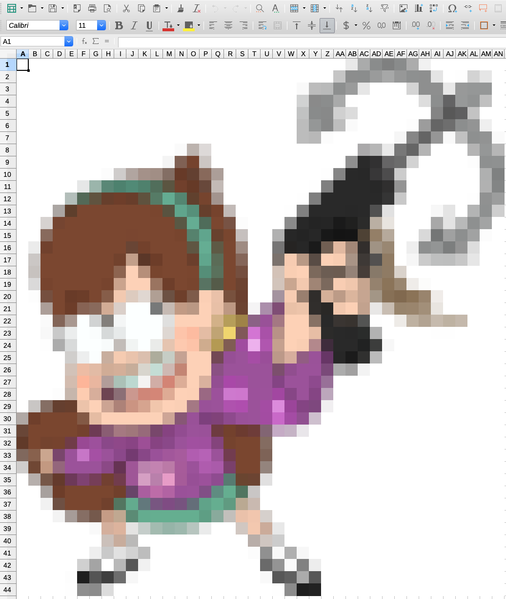

<!-- README.md is generated from README.Rmd. Please edit that file -->

# image2xlsx

<!-- badges: start -->


<!-- badges: end -->

`image2xlsx` provides a single function to turn an image into an excel
(xlsx) spreadsheet.

It stands on the shoulders of the following giants:

  - [openxlsx](https://cran.r-project.org/package=openxlsx)
  - [magick + imagemagick](https://cran.r-project.org/package=magick)
  - [dplyr](https://cran.r-project.org/package=dplyr)
  - [tidyr](https://cran.r-project.org/package=tidyr)
  - [raster](https://cran.r-project.org/package=raster)

## Installation

You can install from
[GitHub](https://github.com/coolbutuseless/image2xlsx) with:

``` r
# install.packages("devtools")
devtools::install_github("coolbutuseless/image2xlsx")
```

## Rlogo

``` r
library(image2xlsx)
image2xlsx("working/RStudio.png", "man/figures/rlogo.xlsx")
```

A screenshot of `rlogo.xlsx` opened in LibreOffice


## Grappling Hook\!

``` r
library(image2xlsx)
image2xlsx("working/mabel.png", "man/figures/mabel.xlsx")
```

A screenshot of `mabel.xlsx` opened in LibreOffice


